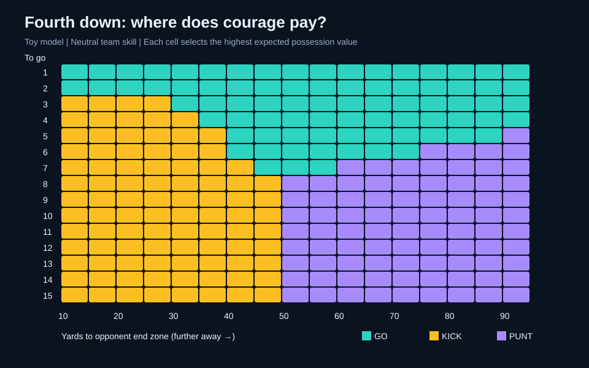
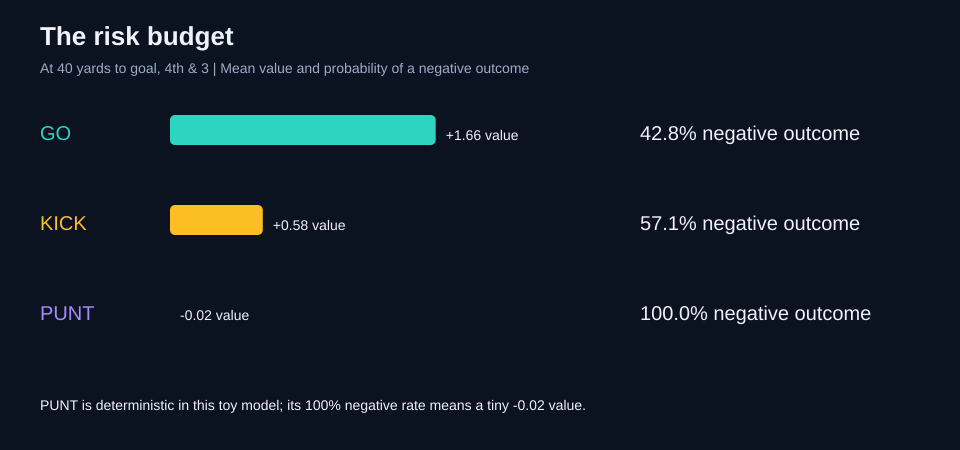
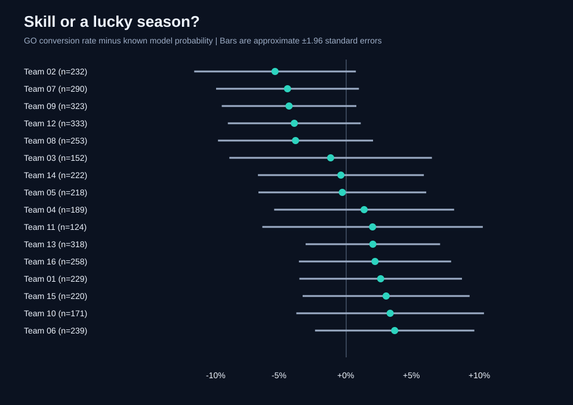

# 第四檔決策實驗室：勇氣、風險與運氣

**全部數據均為 Python 生成的模擬美式橄欖球數據，並非 NFL 真實比賽資料。**

## 核心結果

- 16 支虛構球隊、12,000 次第四檔情境，固定亂數種子 813。
- 模擬教練有 77.5% 的決策與模型的最高預期價值選項一致。
- 平均每次決策損失 0.149 個模型價值單位：定義為最佳選項的預期價值減去實際選項的預期價值。
- 距達陣區 40 碼、第四檔需推進 3 碼時，最高預期價值選項為 **GO**。

## 1. 勇氣地圖



GO = 強攻；KICK = 射門；PUNT = 棄踢。每格比較三種選項的預期價值。強攻成功率隨需推進碼數增加而下降；射門成功率隨距離增加而下降。這些模式是模型設計的結果，不能當成從真實聯盟發現的規律。

## 2. 高平均值不等於低風險



該情境的強攻預期價值為 1.66，負值機率 42.8%；射門預期價值為 0.58，負值機率 57.1%。圖中比較的是模型價值，不是得分或勝率。棄踢採固定 -0.02，因此雖有 100% 的負值機率，損失幅度很小；單看負值機率會誤導。

追分時是否應冒險，還需要剩餘時間、分差與勝率模型。本實驗只展示均值與風險的差異，不對追分戰術作結論。

## 3. 運氣濾鏡



每隊實際強攻成功率減去每次情境的已知成功機率平均值，將情境難度和模型球隊能力納入基準。誤差棒為條件於這些機率的約 95% 常態區間，16 隊比較未做多重比較修正。殘差不是能力排名；它只量化這次模擬中隨機結果的偏離。真实資料沒有已知機率，需要另建並驗證預測模型。

## 模型與限制

- 強攻成功機率：sigmoid(0.95 - 0.22 × 需推進碼數 + 球隊能力)。球隊能力從 N(0, 0.28²) 生成。
- 射門成功機率：sigmoid(5.7 - 0.105 × (距達陣區碼數 + 17))；17 碼是此實驗假設。
- 若 y 為距達陣區碼數，強攻成功价值 = 2 + 4(1-y/100)，失敗 = -(1.2+2y/100)；射門成功 = 3，失敗 = -(0.6+1.6y/100)；棄踢 = 0.3-0.008y。
- 這些手工設定的價值是示範單位，沒有經過 NFL EPA 校準，也不含真正的後續攻防序列。
- 教練在各選項價值加入 N(0, 0.7²) 雜訊後選最大值；直接比較各選項的觀察平均值會受選擇偏差影響。
- 無時間、分差、天氣、防守、傷病或棄踢波動；不是教練實戰建議。
- 程式包含資料筆數、機率範圍與非負 regret 檢查。

## 重跑

```bash
python analysis.py
```

Python 3.10 或以上，無第三方套件。程式會在自身所在目錄重新生成 CSV、JSON、三張 SVG 圖、Markdown 與 HTML 報告。CSV 空白的 success / success_probability 代表棄踢情境不適用。
